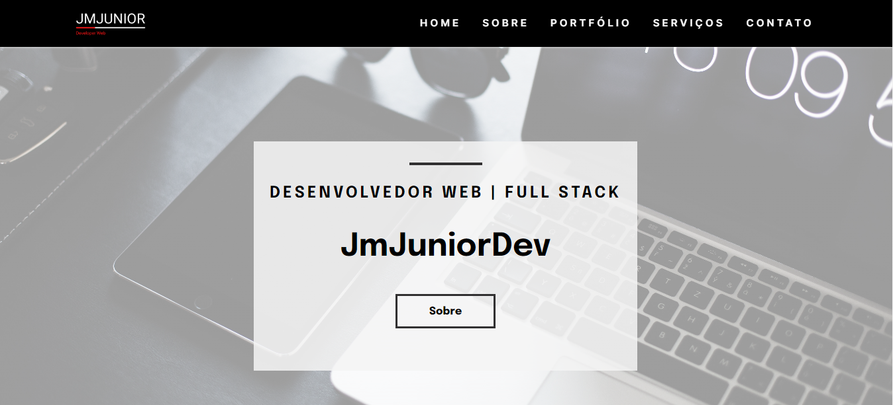

# JmJunior - Desenvolvedor Web

> Portfólio

Projeto de portfólio construído para praticar conhecimentos em desenvolvimento web e para divulgar alguns projetos criados.

[Cliquei aqui para acessar](https://jmjuniordeveloper.netlify.app/)

## 🛠️ Tecnologias

- HTML
- CSS
- JavaScript
- Git e Github

## 🖤 Contato

jmjuniormonteiro@gmail.com

https://www.linkedin.com/in/jmjuniordeveloper/

https://www.instagram.com/jmjuniordeveloper/
